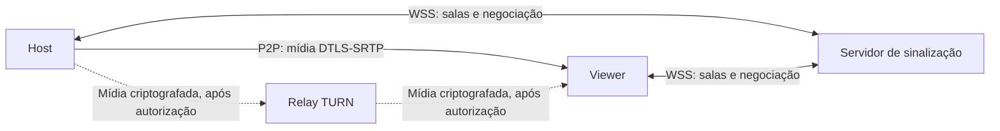

# Lazarus Share

**Compartilhamento de tela portátil, sem login, com conexão P2P e código aberto.**

O host captura um monitor, aprova quem entra e transmite para até quatro viewers.
O vídeo e o áudio seguem diretamente entre os computadores quando a rede permite.
Se a conexão direta falhar, o app oferece um relay criptografado, ativado somente
com autorização explícita do host e daquele viewer.

Sem contas, telemetria, anúncios, gravação ou histórico de salas no servidor.
O app é gratuito; quem hospeda a infraestrutura paga o servidor e o tráfego.

> **Versão atual: 0.1.3, experimental.** O caminho Linux/Intel foi testado
> localmente. O EXE Windows foi recompilado nativamente e passou no teste de
> abertura portátil em Windows no CI. Testes reais entre PCs, outras GPUs e redes de operadora continuam
> pendentes. Consulte a [matriz de validação](docs/VALIDATION.md).

## Downloads da versão experimental

| Plataforma | Executável portátil |
| --- | --- |
| Linux x64 | [LazarusShare-x86_64.AppImage](https://github.com/LazaroLanderson/lazarus-share/releases/download/v0.1.3/LazarusShare-x86_64.AppImage) |
| Windows x64 | [LazarusShare.exe](https://github.com/LazaroLanderson/lazarus-share/releases/download/v0.1.3/LazarusShare.exe) |

[Notas da versão e arquivos](https://github.com/LazaroLanderson/lazarus-share/releases/tag/v0.1.3)
· [Hashes SHA-256 dos executáveis](https://github.com/LazaroLanderson/lazarus-share/releases/download/v0.1.3/SHA256SUMS)

Para testar, configure seu próprio servidor de salas conforme o guia abaixo.
O EXE Windows foi corrigido após uma falha de biblioteca C++ no primeiro pacote.
Se você baixou antes dessa correção, baixe novamente. Captura e conexão em
Windows 10/11 ainda precisam de testes em equipamentos reais.

## Índice

- [Recursos](#recursos)
- [Plataformas e estado dos testes](#plataformas-e-estado-dos-testes)
- [Como funciona](#como-funciona)
- [Executar os pacotes](#executar-os-pacotes)
- [Primeiro teste na mesma rede](#primeiro-teste-na-mesma-rede)
- [Criar sala e compartilhar](#criar-sala-e-compartilhar)
- [Qualidade e aceleração](#qualidade-e-aceleração)
- [Privacidade e segurança](#privacidade-e-segurança)
- [Hospedar na internet](#hospedar-na-internet)
- [Compilar](#compilar)
- [Testes](#testes)
- [Resolver problemas](#resolver-problemas)
- [Estrutura do projeto](#estrutura-do-projeto)
- [Contribuir e publicar](#contribuir-e-publicar)
- [Licença](#licença)

## Recursos

| Recurso | Comportamento |
| --- | --- |
| Captura | Um monitor por host, com cursor incluído |
| Salas | Convite aleatório de 128 bits, apresentado como token de 26 caracteres |
| Aprovação | O host aprova cada viewer, pode removê-lo e encerra a sala |
| Viewers | Até quatro conexões aprovadas simultâneas |
| Qualidade | Largura/altura máximas, FPS alvo e teto de bitrate por viewer |
| Vídeo | H.264 por hardware quando o teste do encoder passa; VP8 por CPU como alternativa |
| Áudio | Desligado inicialmente; somente aplicativos selecionados pelo host |
| Conexão | WebRTC P2P, com STUN configurável e TURN somente após dupla autorização |
| Criptografia | DTLS-SRTP para mídia; negociação autenticada com o segredo do convite |
| Diagnóstico | Rota por viewer, candidatos, estágio, bitrate, perda, latência e FPS |
| Distribuição | AppImage Linux e EXE portátil Windows, sem instalador |

Esta versão não inclui controle remoto, chat, gravação, webcam, microfone,
múltiplos hosts ou compartilhamento de vários monitores ao mesmo tempo.

## Plataformas e estado dos testes

| Plataforma/recurso | Estado |
| --- | --- |
| Linux x64, Pop!_OS 24.04/COSMIC/Wayland | Alvo principal; captura real pelo portal já testada localmente |
| Linux X11 | Captura implementada; validação real pendente |
| Intel Iris Xe no Linux | H.264 por VA-API validado em testes locais |
| NVIDIA NVENC | Detecção e caminho de codificação implementados; teste em NVIDIA pendente |
| Intel Quick Sync no Windows | Detecção e caminho de codificação implementados; teste em hardware pendente |
| Windows 10 22H2 e Windows 11 x64 | Alvos de suporte; abertura portátil validada no CI Windows Server 2022; captura real pendente |
| Áudio seletivo Linux | Isolamento validado com PipeWire privado; teste entre PCs pendente |
| Áudio seletivo Windows | Implementado com detecção de capacidade; teste real pendente |
| Rede Dtel e outra operadora | Teste de aceitação de 30 minutos pendente |

No Wayland, PipeWire e um portal ScreenCast funcional são requisitos do sistema.
Os drivers gráficos também pertencem ao sistema. O pacote inclui Qt, GStreamer,
codecs e plugins usados pelo app; não baixa componentes ao abrir.

No Windows, captura de áudio por processo depende da API disponível na build do
sistema. Quando ela está indisponível, o app mantém vídeo e desabilita áudio
seletivo. Não substitui essa função por captura de todo o som do computador.

## Como funciona



O servidor de sinalização coordena criação, entrada, aprovação e negociação de
conexão. No modo direto, ele não recebe a mídia. O host captura uma vez, mas
codifica e envia por viewer para adaptar o bitrate de cada conexão.

P2P pode falhar por NAT, CGNAT, firewall ou políticas da operadora. STUN ajuda a
descobrir rotas; não garante conectividade. TURN oferece uma rota alternativa,
incluindo TCP/TLS, quando configurado pelo operador e autorizado pelos clientes.
Também não há garantia de atravessar todos os firewalls.

## Executar os pacotes

Os arquivos gerados são:

- `LazarusShare-x86_64.AppImage`: Linux x64.
- `LazarusShare.exe`: Windows x64.

Os builds locais ficam em `dist/`, que não é versionado. Depois de publicados,
os executáveis devem ser distribuídos pelos assets de uma **Release** do GitHub.
O projeto ainda não fornece um endereço público de sinalização embutido; é
necessário configurar seu próprio servidor, inclusive para o teste inicial.

### Linux

```sh
chmod +x LazarusShare-x86_64.AppImage
./LazarusShare-x86_64.AppImage
```

Se FUSE não estiver disponível, use a alternativa de extração e execução:

```sh
./LazarusShare-x86_64.AppImage --appimage-extract-and-run
```

Verificação opcional das dependências e do encoder disponível:

```sh
./LazarusShare-x86_64.AppImage --appimage-extract-and-run --check-runtime
./LazarusShare-x86_64.AppImage --appimage-extract-and-run --check-encoder
```

### Windows

Abra `LazarusShare.exe`. O arquivo reúne o app e suas bibliotecas, extrai os
componentes em uma pasta temporária privada e inicia o cliente. Não exige
instalador nem privilégios de administrador. Ao sair normalmente, remove a
pasta temporária; encerramento forçado pode deixá-la no disco. Não há gravações
de tela nessa pasta.

## Primeiro teste na mesma rede

Você pode hospedar a sinalização no próprio PC Linux e usar um segundo PC
Linux ou Windows como viewer. Não precisa de VPS para testar na LAN.

### 1. Preparar o servidor local

Na raiz do projeto, com Python 3.12 ou superior:

```sh
python3 -m venv .venv
.venv/bin/pip install -r server/requirements.txt
```

Descubra o IP privado da interface Wi-Fi/Ethernet do Linux e substitua o endereço
abaixo pelo seu IP:

```sh
./scripts/start-local-server.sh --bind 192.168.1.25 --port 8443
```

O serviço exibe o endereço WSS e a impressão SHA-256 do certificado. Mantenha
essa janela do terminal aberta durante o teste. Para parar, pressione Ctrl+C.

### 2. Configurar os dois clientes para o teste local

Os campos de servidor, STUN e certificado não aparecem na janela. Por padrão,
o app conecta à VPS do projeto (`129.148.20.150`), com salas HTTPS e STUN próprios.
O usuário final cria a sala ou insere o convite, sem configurar a conexão.

Para um teste local de desenvolvimento, configure as variáveis antes de abrir:

```sh
LAZARUS_SIGNAL_URL='wss://192.168.1.25:8443/ws' \
LAZARUS_TLS_PIN='IMPRESSAO_SHA256_EXIBIDA_PELO_SERVIDOR' \
LAZARUS_STUN_URL='' ./LazarusShare-x86_64.AppImage
```

No Windows, configure as mesmas variáveis de ambiente antes de iniciar o EXE.
A mudança de servidor desativa os padrões de certificado e STUN da VPS; eles
precisam ser definidos explicitamente para esse teste.

Copie a impressão diretamente da saída do seu servidor por um meio confiável.
O app verifica aquele certificado específico, sem aceitar indiscriminadamente
certificados inválidos. O exemplo de IP acima não é um servidor do projeto.

O certificado, a chave privada e a configuração local ficam em `.local-server/`,
fora do Git. As salas continuam somente em memória. Essa configuração local
não inclui TURN e não publica o serviço na internet.

### 3. Validar a conexão

Use **Vídeo de teste** na primeira sala para testar mídia sem expor sua tela.
Siga os passos de criação e aprovação da próxima seção. Depois, encerre a sala
e repita com a captura real.

Dois clientes no mesmo PC permitem testar negociação, aprovação e mídia. Esse
teste não valida a conexão entre máquinas nem os bloqueios de uma operadora.

Os PCs precisam conseguir se alcançar na rede. Se necessário, permita TCP/8443
no firewall do Linux somente para a LAN. Redes de convidados e isolamento de
clientes Wi-Fi podem impedir a conexão. Não redirecione essa porta no roteador
para transformar o servidor de teste em serviço público.

## Criar sala e compartilhar

1. Configure o mesmo servidor nos dois clientes.
2. No host, ajuste resolução máxima, FPS e bitrate. Para diagnóstico, marque
   **Vídeo de teste** antes de criar a sala.
3. Clique **Criar sala**. Em captura real Wayland, selecione o monitor no diálogo
   do sistema; em X11/Windows, use a seleção de monitor do app.
4. Clique **Copiar token** e envie o convite ao viewer por um meio confiável.
5. No viewer, cole o token e clique **Entrar com token**.
6. No host, selecione a solicitação na lista e clique **Aprovar**. O vídeo começa
   após aprovação e negociação.
7. Para transmitir áudio, marque somente os aplicativos autorizados. Microfone
   não faz parte desta versão. Aplicativos novos ou reiniciados exigem nova seleção.
8. Use **Aplicar** para alterar a qualidade durante a sessão e **Remover** para
   encerrar a conexão de um viewer.
9. Se a tentativa direta falhar e seu servidor tiver TURN configurado, host e
   viewer podem clicar **Autorizar relay**. A autorização vale para aquela conexão;
   o app não habilita relay silenciosamente.
10. Use **Encerrar / sair** no host para encerrar a sala.

Sem contas, a solicitação identifica o viewer por um ID temporário. Confirme com
seu contato qual solicitação aprovar; o token não prova a identidade da pessoa.

## Qualidade e aceleração

O padrão é **1920×1080, 60 FPS e teto de 8.000 kbps por viewer**. Esses valores são
alvos, não uma promessa de desempenho. A resolução preserva a proporção dentro
da largura e altura máximas. O bitrate pode cair em resposta ao congestionamento.

Cada viewer consome upload do host. Com quatro viewers próximos ao teto padrão,
só o vídeo pode chegar a aproximadamente 32 Mbps de upload, além de áudio e
sobrecarga de transporte. Relay também consome o upload do host.

O app procura encoders NVIDIA NVENC, Intel Quick Sync e VA-API. Antes de escolher
um deles, testa codificação H.264 e decodificação de quadros. Se nenhum caminho
por hardware passar, usa VP8 por CPU. O encoder escolhido aparece na interface.
O teste inicial de capacidade não garante todas as resoluções nem carga sustentada.

H.264 é decodificado por OpenH264 na CPU nesta versão. A captura redimensiona uma
vez e compartilha I420 entre viewers; a conversão e o envio para o encoder são
feitos em cada conexão. Ainda não é um caminho de captura zero-copy.

Compare **FPS de captura** com **FPS de vídeo por viewer** para localizar o
limite. A origem de captura, CPU/GPU, quantidade de viewers, movimento da tela,
resolução e rede podem limitar a taxa efetiva.

Para reproduzir a alternativa por CPU em desenvolvimento no Linux:

```sh
LAZARUS_VIDEO_ENCODER=vp8 ./build/lazarus-share
```

## Privacidade e segurança

“Sem coleta” significa ausência de telemetria, anúncios, gravações e histórico
de salas. Não significa que uma conexão de rede funcione sem processar IPs.

| Componente | O que processa |
| --- | --- |
| Cliente | Captura autorizada, convite e negociação; cache técnico local de plugins |
| Sinalização | Identificador derivado da sala, conexões, aprovação e negociação em memória; pode ver IPs e candidatos ICE |
| Relay | Endpoints e volume de tráfego; encaminha mídia criptografada |
| Diagnóstico manual | Métricas e capacidades, com segredos e dados sensíveis removidos; sem envio automático |

O segredo do convite permanece nos clientes. O servidor recebe um identificador
derivado; a credencial de administração é separada do convite. As mensagens de
negociação, incluindo fingerprints, são autenticadas com o segredo do convite.
A mídia usa DTLS-SRTP, inclusive ao atravessar TURN.

Participantes com o convite compartilham o mesmo segredo. Isso não fornece
identidades independentes nem proteção contra outro participante malicioso que
já possui esse convite. Viewers autorizados também podem gravar a tela usando
outros programas.

O servidor não usa banco de dados. Após desconexão do host, mantém a sala por
até 60 segundos para permitir retomada e depois a encerra. Reiniciar o serviço
apaga seu estado em memória. Os exemplos de infraestrutura desativam logs de
acesso equivalentes no proxy, Coturn e containers. Provedor de hospedagem, DNS,
firewall e sistema operacional podem ter políticas próprias de retenção.

Não publique tokens, chaves, `.env`, certificados locais ou diagnósticos brutos
em issues. Detalhes técnicos estão no [protocolo e limites de privacidade](docs/PROTOCOL.md).

## Hospedar na internet

A infraestrutura autohospedável inclui sinalização Python/aiohttp, Nginx com TLS
e Coturn. O [guia de implantação](docs/DEPLOYMENT.md) inclui o modo de salas/P2P
com um IP e o deploy automático por GitHub Actions, com teste HTTPS e rollback.
A automação precisa dos dados e da chave SSH da VPS para ser habilitada.

O exemplo exige domínios, certificados TLS válidos e endereços públicos separados
para sinalização e TURN quando ambos usam TCP/443. Pode-se hospedar TURN em outra
máquina. As credenciais TURN são temporárias, emitidas somente para participantes
aprovados e depois do consentimento dos dois lados.

Na versão atual, as credenciais TURN expiram após uma hora; uma nova sessão é
necessária para renovar autorização e credenciais. O tráfego de relay precisa
ser dimensionado e pago pelo operador.

Configuração de desenvolvimento por variáveis de ambiente (sem campos na janela):

| Variável | Finalidade |
| --- | --- |
| `LAZARUS_SIGNAL_URL` | URL de sinalização: `wss://salas.seu-dominio/ws` |
| `LAZARUS_STUN_URL` | STUN próprio, por exemplo `stun://turn.seu-dominio:3478` |
| `LAZARUS_TLS_PIN` | Impressão SHA-256 opcional do certificado local |
| `LAZARUS_VIDEO_ENCODER` | `vp8` para forçar CPU em testes; omitir para seleção automática |

Não há STUN/TURN público de terceiros configurado automaticamente. Fora de
loopback, use WSS. O serviço HTTP interno deve ficar atrás do proxy TLS, sem
expor diretamente sua porta à internet.

## Compilar

Base: **C++20, CMake 3.24+, Qt 6.4+, GStreamer 1.22+ e libnice**.
No Linux, a captura/seleção de áudio também usa PipeWire e Qt DBus.

### Linux: Pop!_OS/Ubuntu 24.04

Instale dependências de desenvolvimento:

```sh
sudo apt-get update
sudo apt-get install cmake build-essential pkg-config python3-venv \
  qt6-base-dev qt6-websockets-dev qt6-wayland qt6-qpa-plugins \
  libgstreamer1.0-dev libgstreamer-plugins-base1.0-dev \
  libgstreamer-plugins-bad1.0-dev libpipewire-0.3-dev \
  gstreamer1.0-plugins-base gstreamer1.0-plugins-good \
  gstreamer1.0-plugins-bad gstreamer1.0-nice gstreamer1.0-pipewire \
  gstreamer1.0-pulseaudio
cmake -S . -B build -DCMAKE_BUILD_TYPE=Release
cmake --build build -j
./build/lazarus-share
```

O portal ScreenCast e os drivers devem estar instalados e funcionando na sessão
do usuário. Compilar não substitui esses recursos do sistema.

### Windows: MSYS2 MINGW64

No terminal **MINGW64** do MSYS2, instale as dependências usadas pela automação:

```sh
pacman -S --needed mingw-w64-x86_64-gcc mingw-w64-x86_64-cmake \
  mingw-w64-x86_64-ninja mingw-w64-x86_64-pkgconf \
  mingw-w64-x86_64-qt6-base mingw-w64-x86_64-qt6-websockets \
  mingw-w64-x86_64-gstreamer mingw-w64-x86_64-gst-plugins-base \
  mingw-w64-x86_64-gst-plugins-good mingw-w64-x86_64-gst-plugins-bad \
  mingw-w64-x86_64-libnice mingw-w64-x86_64-python
cmake -S . -B build -G Ninja -DCMAKE_BUILD_TYPE=Release
cmake --build build
```

A receita completa está no [workflow de build](.github/workflows/build.yml).
SDKs e ferramentas são requisitos de desenvolvimento, não dos usuários dos pacotes.

### Gerar pacotes portáteis

Linux, com dependências instaladas nos caminhos da distribuição suportada:

```sh
python3 packaging/linux/bundle.py
ARCH=x86_64 appimagetool --appimage-extract-and-run \
  dist/LazarusShare.AppDir dist/LazarusShare-x86_64.AppImage
```

`appimagetool` é uma ferramenta adicional de empacotamento; o workflow usa a
versão 1.9.1 do projeto AppImage. O bundler resolve as dependências e copia os
plugins; drivers e glibc continuam pertencendo ao sistema.

Windows, no ambiente MINGW64 após compilar:

```sh
python packaging/windows/bundle.py
```

O script reúne DLLs, verifica dependências e monta o executável com o payload.
Licenças das dependências são incluídas nos dois pacotes.

## Testes

Testes de protocolo, mídia direta, integridade de imagem em 1080p e portal Linux:

```sh
ctest --test-dir build --output-on-failure
```

Esses testes usam sockets locais. Precisam de um ambiente que permita abrir
conexões; um sandbox que bloqueie sockets impede sua execução. O portal tem
um teste de resposta DBus sem seleção manual. No Windows, a automação executa
o teste de protocolo, verifica os símbolos das DLLs incluídas e inicia o EXE
portátil com `--check-runtime` e `--smoke-test`, com PATH sem o ambiente de
desenvolvimento. Os testes completos de mídia foram validados no Linux.

Servidor e sessão completa com quatro viewers:

```sh
.venv/bin/python -m unittest discover -s server/tests -v
.venv/bin/python server/tests/local_tls.py
```

Testes adicionais de desenvolvimento:

```sh
# Requer Coturn instalado ou LAZARUS_TURNSERVER apontando para o executável.
python3 server/tests/relay_local.py
# Requer PipeWire/WirePlumber e recursos de isolamento compatíveis.
python3 server/tests/audio_isolated.py
```

Os testes automatizados usam vídeo e áudio sintetizados. Não gravam sua tela
nem substituem a validação de captura real, áudio real, máquinas limpas,
Windows, NAT de operadora ou TURN/TLS público na porta 443.

Na 0.1.2, o pacote Linux com Intel Iris Xe recebeu **467 quadros em oito segundos**
no teste sintético de 1920×1080/60, sem corrupção detectada pelo teste. Isso
inclui o início da conexão e não certifica 60 FPS sustentados de captura real.
Também passaram CPU/VP8, quatro viewers com alteração de qualidade e relay
local por UDP, TCP e TLS. Resultados e pendências: [VALIDATION.md](docs/VALIDATION.md).

## Resolver problemas

| Sintoma | O que verificar |
| --- | --- |
| Upload em 0 kbps | Sem viewer aprovado e conectado, não há envio de vídeo. Confira aprovação e negociação. |
| Não conecta ao servidor | URL, servidor em execução, alcance de rede, firewall e certificado/impressão SHA-256. |
| Não conecta entre PCs na LAN | IP privado correto, mesma rede, isolamento de Wi-Fi e firewall local. |
| P2P falha na internet | STUN próprio e diagnóstico ICE; para alternativa, configure TURN e autorize nos dois lados. |
| Relay não aparece ou não conecta | Falha direta, dupla autorização, configuração do servidor, credenciais e portas de TURN. |
| Portal não permite selecionar tela | Portal ScreenCast/PipeWire funcional e sessão Wayland; confira os recursos da sua distribuição. |
| FPS baixo | Encoder indicado, FPS de captura/vídeo, resolução, carga da CPU/GPU, upload e quantidade de viewers. |
| Áudio não aparece | Seleção explícita, app produzindo som, novo stream/processo após reinício e suporte da API no Windows. |
| AppImage não abre por FUSE | Use `--appimage-extract-and-run`. |
| Imagem fragmentada em pacote antigo | Atualize os dois clientes para 0.1.2; essa versão corrige descarte de fragmentos RTP. |

Use **Exportar diagnóstico** para compartilhar métricas sanitizadas manualmente.
Para investigar uma queda no caminho de captura Linux, há o roteiro manual
[`scripts/diagnose-capture.sh`](scripts/diagnose-capture.sh), que requer GDB.
Antes de abrir uma issue, confira se o conteúdo anexado não contém informações
que você não quer tornar públicas.

## Estrutura do projeto

```text
app/                 Cliente Qt, captura, áudio, WebRTC e protocolo
server/              Sinalização em memória e servidor TLS local
server/tests/        Testes de salas, sessão, relay e áudio
infra/               Docker Compose, Nginx e exemplo de configuração
packaging/linux/     AppDir/AppImage e bibliotecas Linux
packaging/windows/   DLLs, payload e launcher portátil
scripts/             Inicialização local e diagnóstico manual
.github/workflows/   Compilação e verificação Linux/Windows
docs/               Protocolo, implantação, validação e licenças
```

## Contribuir e publicar

Issues com passos de reprodução são bem-vindas. Informe versão do app,
sistema/sessão, GPU, encoder escolhido, configuração de qualidade, quantidade
de viewers e rota. Inclua métricas sanitizadas quando ajudarem a reproduzir.
Para alterações, descreva o comportamento esperado e os testes relevantes.
Não inclua dados pessoais, tokens ou segredos de infraestrutura.

O workflow do GitHub Actions roda em pushes, pull requests e execução manual.
Ele prepara artifacts de Linux e Windows; **não cria uma Release automaticamente**.
Execução do CI depende de o repositório e os runners estarem disponíveis.

Para publicar uma versão:

1. Confirme os resultados da [matriz de validação](docs/VALIDATION.md), identificando
   o que foi testado e o que permanece experimental.
2. Compile os clientes a partir da revisão que será marcada pela tag.
3. Gere e confira os pacotes, suas bibliotecas e licenças.
4. Crie uma Release com notas de versão e anexe o AppImage, EXE e respectivos
   hashes SHA-256. Se distribuir um ZIP de fontes preparado manualmente, confira
   que ele contém somente arquivos públicos.
5. Distribua executáveis pelos assets da Release, sem adicioná-los ao histórico Git.

O [`.gitignore`](.gitignore) exclui builds, pacotes, ambientes Python, caches,
logs, dumps, certificados e configuração privada. Mantém
[`infra/.env.example`](infra/.env.example) versionável. Regras de ignore não
removem arquivos já rastreados: revise o conteúdo preparado antes do primeiro push.

## Licença

O código do projeto é **GPL-3.0-only**. Veja [LICENSE](LICENSE).
Qt, GStreamer, libnice, PipeWire, VP8, Opus, OpenH264 e outras dependências têm
suas próprias licenças. Consulte [THIRD_PARTY.md](docs/THIRD_PARTY.md) e os
[avisos de dependências](docs/licenses/notices). Os pacotes incluem esses avisos.
